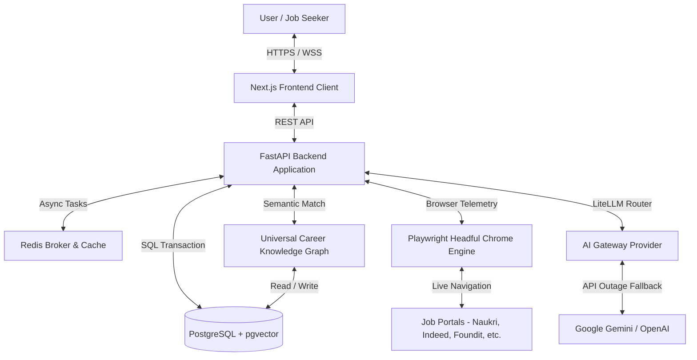

# CareerOS Infinity - AI Career Intelligence & JobPilot Autonomous Engine

CareerOS Infinity is an enterprise-grade, asynchronous AI Career Intelligence Platform & Autonomous Job Hunter designed to ingest resumes, validate layouts, structure profile data, run semantic ATS match analytics, and automate job applications across 27+ top portals with headful browser telemetry and TruthGuard safety.

---

## 🚀 Key Features & Capabilities

- **JobPilot Live Application Control Center**: Real-time browser telemetry, session authentication monitoring, and application state machine tracking.
- **TruthGuard Safety Engine**: Prevents hallucinated experience or fabricated skills during automated resume tailoring.
- **Multi-Portal Browser Automation**: Native headful Chrome automation supporting **27 top job portals** (Naukri.com, Indeed India, Foundit, Shine, TimesJobs, Glassdoor, Apna, Cutshort, LinkedIn, Unstop, and more).
- **Direct Apply Mode**: Autonomous candidate-approved job application submission with instant database logging and evidence verification.
- **Knowledge Graph Analytics**: PostgreSQL + `pgvector` semantic matching for job fit scoring and priority ranking.
- **Email Confirmation Sync**: Automated IMAP/SMTP background verification of employer receipt emails.

---

## 1. System Architecture (C4 Model)



---

## 2. Technology Stack

* **Frontend Web Client:** Next.js (v14), TailwindCSS, TypeScript, Lucide Icons, Zustand.
* **Backend Server:** FastAPI (Python 3.11/3.13), SQLAlchemy (Async), Uvicorn.
* **Browser Automation:** Playwright Async API, Headful Chromium / Google Chrome instance driver.
* **Database Platform:** PostgreSQL 15, `pgvector` (HNSW Semantic Indexing), GraphNode entities.
* **AI Integrations:** LiteLLM Gateway Routing (Google Gemini 3.5 Flash / Flash Lite / OpenAI).
* **Testing & Quality:** Pytest (129/129 regression tests passing).

---

## 3. Local Startup Guide

### 3.1 Backend Server (FastAPI + Uvicorn)
```bash
cd backend
venv\Scripts\python.exe -m uvicorn app.main:app --host 0.0.0.0 --port 8000
```

### 3.2 Frontend Web App (Next.js)
```bash
cd frontend
npm run dev
```

### 3.3 Desktop Headful Browser Launcher
To trigger a standalone interactive Chrome window on your Windows desktop screen:
```bash
python run_live_browser.py
```

Endpoints once initialized:
* **Web Control Center UI:** [http://localhost:3000/](http://localhost:3000/)
* **API Interactive Docs:** [http://localhost:8000/docs](http://localhost:8000/docs)
* **Browser Telemetry Status:** [http://localhost:8000/api/v1/applications/browser-status](http://localhost:8000/api/v1/applications/browser-status)

---

## 4. API Reference Summary

| Method | Endpoint Path | Scope Description |
| :--- | :--- | :--- |
| `POST` | `/api/v1/applications/apply` | Trigger single portal auto-apply pipeline |
| `POST` | `/api/v1/applications/launch-session` | Open headful Chrome session for portal login |
| `POST` | `/api/v1/applications/verify-login` | Confirm manual candidate portal session authentication |
| `GET` | `/api/v1/applications/browser-status` | Query live Playwright browser process telemetry |
| `GET` | `/api/v1/applications` | List active job applications & GraphNode records |
| `POST` | `/api/v1/resumes/upload` | Ingest candidate resume PDF/DOCX |

---

## 5. Automated Test Suite

Run the complete 129-test regression suite covering JobPilot Parts 1 through 7:
```bash
cd backend
venv\Scripts\pytest
```

---

## 📜 License
Privately developed for **CareerOS Infinity Platform**. All rights reserved.
