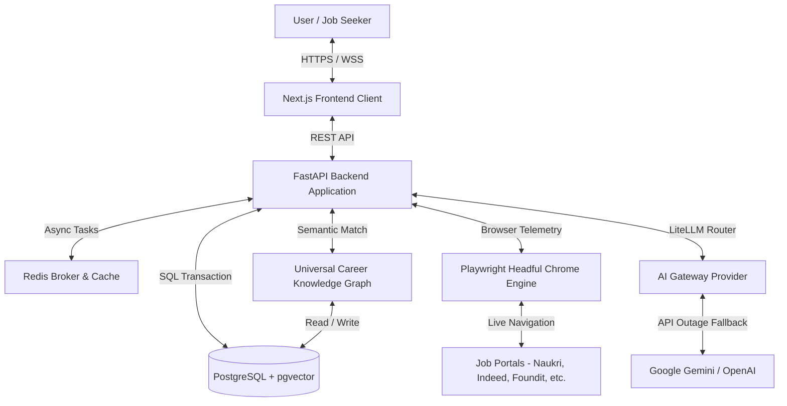

# CareerOS Infinity — AI Career Intelligence Platform

AI-powered career development, resume analysis, job matching, and interview preparation.

    

## What is CareerOS?

CareerOS is a comprehensive platform designed to elevate your job search through AI resume parsing & ATS scoring, intelligent job matching, seamless application tracking, and dynamic interview preparation. By analyzing your unique profile and matching it against real market demands, it provides actionable insights that maximize your chances of success. CareerOS is NOT an auto-apply bot — it's a career intelligence platform that helps you make smarter application decisions.

## Core Features

- **🎯 Resume Intelligence:** AI parsing, ATS scoring, version tracking, and TruthGuard verification.
- **🔍 Job Match Discovery:** AI job matching, ATS fit scoring, and filtering by location, seniority, or skills.
- **📊 Application Tracker:** Kanban board, status tracking, and analytics dashboard.
- **🎤 Interview Prep Studio:** AI-generated questions from job descriptions, covering behavioral, technical, and situational categories.

## System Architecture



## Technology Stack

* **Frontend Web Client:** Next.js (v14), TailwindCSS, TypeScript, Lucide Icons, Zustand.
* **Backend Server:** FastAPI (Python 3.11/3.13), SQLAlchemy (Async), Uvicorn.
* **Browser Automation:** Playwright Async API, Headful Chromium / Google Chrome instance driver.
* **Database Platform:** PostgreSQL 15, `pgvector` (HNSW Semantic Indexing), GraphNode entities.
* **AI Integrations:** LiteLLM Gateway Routing (Google Gemini 3.5 Flash / Flash Lite / OpenAI).
* **Testing & Quality:** Pytest (129/129 regression tests passing).

## Quick Start

### Backend Server (FastAPI + Uvicorn)
```bash
cd backend
venv\Scripts\python.exe -m uvicorn app.main:app --host 0.0.0.0 --port 8000
```

### Frontend Web App (Next.js)
```bash
cd frontend
npm run dev
```

## Project Structure

```
CareerOS/
├── backend/       # FastAPI application, database models, and background tasks
├── frontend/      # Next.js web application and UI components
├── docs/          # Project documentation and C4 diagrams
└── scripts/       # Utility scripts for database migrations and setup
```

## License
MIT

---
Built by Niraj Kadam
